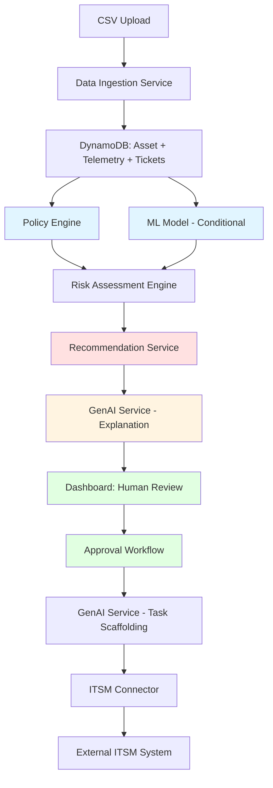

# Data Requirements and Decision Flow

## Overview

This document specifies the exact data requirements for each component in the Intelligent E-Waste & Asset Lifecycle Optimizer and describes the decision-making flow from raw data ingestion through to human-readable recommendations.

---

## ML Model Feature Requirements

**Input Features:**
1. **Asset Metadata**
   - `age_in_months` (derived from `purchase_date`)
   - `device_type` (laptop, server) - one-hot encoded
   - `region` - categorical encoding
   - `department` - categorical encoding

2. **Telemetry Data** (from `Telemetry` dataclass)
   - `battery_cycles` (integer)
   - `smart_sectors_reallocated` (integer)
   - `thermal_events_count` (integer)

3. **Ticket Aggregates** (from `TicketsAggregate` - 90-day window)
   - `total_incidents` (integer)
   - `critical_incidents` (integer)
   - `high_incidents` (integer)
   - `medium_incidents` (integer)
   - `low_incidents` (integer)
   - `avg_resolution_time_hours` (float)

4. **Derived Features** (engineered)
   - Incident rate per month
   - Critical incident ratio
   - Battery degradation rate
   - Thermal events per month of ownership

**Output:**
- `risk_score` (float, 0.0 to 1.0) - Probability of asset failure/degradation
- `confidence_interval` (tuple, optional) - Uncertainty bounds

**Data Completeness Requirement:** Model only runs if telemetry completeness meets threshold (Property 3)

**Model Performance Target:** AUC-ROC ≥ 0.70

---

## Policy Engine Rule Requirements

**Input Data:**
1. **Asset Age**
   - `purchase_date` → calculate `age_in_months`
   - Threshold: ≥ 42 months

2. **Ticket Count** (from `TicketsAggregate`)
   - `total_incidents` over 90-day window
   - Threshold: ≥ 5 tickets

3. **Telemetry Thresholds** (from `Telemetry`)
   - `thermal_events_count` ≥ 10
   - `smart_sectors_reallocated` ≥ 50

**Policy Rules:**
- **High risk** if: `(age ≥ 42 AND tickets ≥ 5)` OR `(thermal_events ≥ 10 OR smart_sectors ≥ 50)`
- **Medium risk** if: partial criteria met
- **Low risk** if: criteria not met

**Output:**
- `policy_classification` (High/Medium/Low)
- `triggered_rules` (list of rule identifiers)
- `policy_version` (string) - For audit trail

**Note:** Policy Engine operates independently of ML model - does NOT require ML risk score as input.

---

## Recommendation Service Requirements

**Input Data:**
1. **Risk Assessment Results**
   - `risk_score` (from ML model or policy-derived score)
   - `confidence_band` (Low/Medium/High)
   - `policy_result` (classification and triggered rules)
   - `ml_result` (optional - only if telemetry sufficient)

2. **Asset Context**
   - `asset_id`
   - `device_type`
   - `age_in_months`
   - `department`
   - `region`
   - `current_state`

3. **Supporting Data**
   - `telemetry` (battery cycles, SMART sectors, thermal events)
   - `tickets_aggregate` (incident counts, severity distribution)

**Recommendation Logic Mapping:**
- **High risk + age ≥ 42 months** → Recycle
- **High risk + repairable issues (thermal/battery)** → Repair
- **Medium risk + good overall condition** → Refurbish
- **Low risk + department change needed** → Redeploy
- **Low risk + excess inventory** → Resale

**Output:**
- `action` (redeploy/repair/refurbish/resale/recycle)
- `confidence_score` (float)
- `rationale` (structured text)
- `supporting_signals` (list of evidence)
- `recommendation_id` (unique identifier)
- `created_at`, `expires_at` (timestamps)

---

## LLM (GenAI Service) Input Requirements

### 1. Recommendation Explanations (Requirement 8)
**Input Context:**
```python
{
    "asset_id": str,
    "device_type": str,
    "age_months": int,
    "department": str,
    "region": str,
    "risk_score": float,  # From ML model or policy
    "confidence_band": str,  # Low/Medium/High
    "recommended_action": str,  # redeploy/repair/refurbish/resale/recycle
    "supporting_signals": [
        "Age: 48 months (exceeds 42-month threshold)",
        "Total incidents: 7 (exceeds 5-ticket threshold)",
        "Thermal events: 15 (exceeds 10-event threshold)",
        "Battery cycles: 850"
    ],
    "policy_result": {
        "classification": "High",
        "triggered_rules": ["age_and_tickets", "thermal_threshold"]
    },
    "ml_result": {
        "risk_score": 0.85,
        "confidence_interval": [0.78, 0.92]
    } if available else None,
    "telemetry": {
        "battery_cycles": 850,
        "smart_sectors": 5,
        "thermal_events": 15
    },
    "tickets": {
        "total_incidents": 7,
        "critical_incidents": 2,
        "avg_resolution_time_hours": 18.5
    }
}
```

**Output:**
- Factual explanation ≤120 words
- Hedged language for uncertainty
- Clear connection between data signals and recommendation

### 2. ITSM Task Scaffolding (Requirement 9)
**Input Context:**
```python
{
    "asset_id": str,
    "recommendation": {
        "action": str,  # recycle/repair/refurbish/redeploy/resale
        "rationale": str,
        "confidence_score": float
    },
    "asset_details": {
        "device_type": str,
        "department": str,
        "region": str,
        "age_months": int
    },
    "compliance_requirements": [
        "E-waste certificate required (India)",
        "Chain of custody documentation",
        "Data destruction certificate"
    ] if applicable
}
```

**Output:**
- Task title (concise, actionable)
- Task description (with context and background)
- Checklist items (specific action steps)
- JSON-formatted structure for ITSM API

### 3. Compliance Document Processing (Requirement 10)
**Input Context:**
```python
{
    "document_type": str,  # certificate/invoice/chain_of_custody
    "region": str,
    "asset_id": str,
    "file_content": str,  # Extracted text from PDF/document
    "required_fields": [
        "certification_number",
        "vendor_name",
        "disposal_date",
        "weight_in_kg",
        "destruction_method"
    ],
    "region_requirements": {
        "India": ["e_waste_certificate", "chain_of_custody", "disposal_invoice"]
    }
}
```

**Output:**
- Summary of key compliance points
- Extracted entities (dates, vendors, certificates)
- Missing requirements flagged
- Verification recommendations

### 4. Conversational Insights (Requirement 11)
**Input Context:**
```python
{
    "user_query": str,  # Natural language question
    "semantic_layer_schema": {
        "assets": ["asset_id", "device_type", "department", "region", "current_state", "age_months"],
        "recommendations": ["recommendation_id", "action", "confidence_score", "created_at"],
        "risk_assessments": ["risk_score", "confidence_band", "assessment_timestamp"],
        "approval_audits": ["actor", "decision", "timestamp", "rationale"]
    },
    "available_aggregations": [
        "count_by_state",
        "count_by_region",
        "avg_risk_score",
        "recommendations_by_action"
    ]
}
```

**Output:**
- Natural language response answering the query
- Data provenance information (sources used)
- Suggested follow-up queries
- Structured data references where applicable

---

## Decision-Making Flow

The system implements a **layered decision architecture** where each component has a specific role:

### Stage 1: Data Ingestion & Validation
```
CSV Upload / API Data
        ↓
[Data Ingestion Service]
        ↓
Validates schema, calculates data_completeness
        ↓
Stores: Asset, Telemetry, TicketsAggregate in DynamoDB
        ↓
Publishes AssetIngested event to EventBridge
```

**Output:** Validated asset records with completeness scores

---

### Stage 2: Risk Assessment (Dual-Path)

#### Path A: Policy Engine (Always Runs)
```
Asset Data (age, tickets, telemetry thresholds)
        ↓
[Policy Engine]
        ↓
Applies deterministic rules:
  - High: (age ≥ 42 AND tickets ≥ 5) OR (thermal ≥ 10 OR smart_sectors ≥ 50)
  - Medium: Partial criteria met
  - Low: Criteria not met
        ↓
Output: PolicyResult {
  classification: High/Medium/Low,
  triggered_rules: ["age_and_tickets", "thermal_threshold"],
  policy_version: "1.0"
}
```

#### Path B: ML Model (Conditional)
```
IF data_completeness >= threshold:
    Asset Features (age, device_type, region, department)
    + Telemetry (battery_cycles, smart_sectors, thermal_events)
    + Ticket Aggregates (total_incidents, severity distribution, resolution time)
            ↓
    [ML Model - Gradient Boosting]
            ↓
    Feature engineering → Model inference
            ↓
    Output: MLResult {
      risk_score: 0.85,
      confidence_interval: [0.78, 0.92],
      model_version: "v2.1"
    }
ELSE:
    Skip ML model, mark for policy-only evaluation
```

#### Combined Risk Assessment
```
PolicyResult + MLResult (if available)
        ↓
[Risk Assessment Engine]
        ↓
Determines confidence_band:
  - High: Both policy and ML agree OR strong telemetry signals
  - Medium: Partial agreement OR sparse data
  - Low: Weak signals OR contradictory indicators
        ↓
Output: RiskAssessment {
  asset_id: "LAP-2891",
  risk_score: 0.85,  # From ML or policy-derived
  confidence_band: High,
  policy_result: {...},
  ml_result: {...} or None,
  assessment_timestamp: "2026-02-28T10:30:00Z",
  model_version: "v2.1",
  policy_version: "1.0"
}
```

**Key Decision Point:** The system does NOT choose between policy or ML - it uses **both** to create a comprehensive risk assessment with confidence bands.

---

### Stage 3: Recommendation Generation

```
RiskAssessment + Asset Context + Business Rules
        ↓
[Recommendation Service]
        ↓
Maps risk to lifecycle action:
        ↓
┌─────────────────────────────────────────────┐
│ IF risk_score >= 0.8 AND age >= 42:        │
│     action = RECYCLE                        │
│ ELIF risk_score >= 0.7 AND repairable:     │
│     action = REPAIR                         │
│ ELIF risk_score >= 0.5:                    │
│     action = REFURBISH                      │
│ ELIF risk_score < 0.3 AND dept_change:     │
│     action = REDEPLOY                       │
│ ELSE:                                       │
│     action = RESALE                         │
└─────────────────────────────────────────────┘
        ↓
Creates structured recommendation with rationale
        ↓
Output: Recommendation {
  recommendation_id: "REC-8821",
  asset_id: "LAP-2891",
  action: RECYCLE,
  confidence_score: 0.85,
  rationale: "High risk classification due to age and thermal issues",
  supporting_signals: [
    "Age: 48 months (exceeds threshold)",
    "Thermal events: 15 (critical level)",
    "Ticket count: 7 (reliability concern)"
  ],
  explanation: null,  # To be generated by LLM
  created_at: "2026-02-28T10:35:00Z",
  expires_at: "2026-03-07T10:35:00Z"  # 7-day expiry
}
```

**Key Decision Point:** The Recommendation Service makes the **actual lifecycle decision** (which action to take) based on risk assessment + business rules. This is deterministic and auditable.

---

### Stage 4: Explanation Generation (LLM)

```
Recommendation + Full Context (asset, risk, telemetry, tickets)
        ↓
[GenAI Service - Amazon Bedrock (Claude 3.5 Sonnet)]
        ↓
Prompt: "Generate factual explanation (≤120 words) for this recommendation..."
        ↓
Input Context: {
  asset_id, device_type, age_months, department, region,
  risk_score, confidence_band, recommended_action,
  supporting_signals: [...],
  policy_result: {...},
  ml_result: {...},
  telemetry: {...},
  tickets: {...}
}
        ↓
LLM Processing (timeout: 10 seconds)
        ↓
IF success:
    Output: "This laptop should be recycled because it exhibits 
            high failure risk (0.85 score) due to excessive thermal 
            events (15 in 90 days) and age beyond replacement 
            threshold (48 months). The device has generated 7 support 
            tickets, indicating declining reliability. Recycling is 
            the most cost-effective action given repair costs would 
            likely exceed replacement value."
ELSE (timeout or service unavailable):
    Fallback to template:
    Output: "Recycle recommended based on high risk score (0.85), 
            age (48 months), and 7 incidents in 90 days."
        ↓
Updates Recommendation.explanation field
        ↓
Transitions asset to ReviewPending state
```

**Key Decision Point:** The LLM does **NOT make decisions** - it only explains decisions already made by the Recommendation Service. It transforms structured data into human-readable narrative.

---

### Stage 5: Human Approval Workflow

```
Recommendation (with explanation)
        ↓
[Dashboard UI]
        ↓
Presents to authorized user for review:
  - Asset details
  - Risk assessment visualization
  - Recommendation with LLM explanation
  - Supporting evidence and signals
        ↓
Human Decision:
  - Approve → Transition to ApprovedFor{Action}
  - Reject → Return to Active state
        ↓
[Approval Workflow]
        ↓
Creates immutable audit record:
  - Actor, timestamp, decision, rationale
  - Complete snapshots of asset + recommendation state
        ↓
Output: ApprovalAudit {
  audit_id: "AUD-5512",
  recommendation_id: "REC-8821",
  actor: "jane.smith@company.com",
  decision: APPROVED,
  rationale: "Agree with assessment, thermal damage evident",
  asset_snapshot: {...},  # Full asset state at approval time
  recommendation_snapshot: {...},  # Full rec state at approval time
  timestamp: "2026-02-28T14:22:00Z"
}
```

**Key Decision Point:** Humans provide the **final authorization** before irreversible actions. The system provides comprehensive context but humans maintain control.

---

### Stage 6: ITSM Task Creation (LLM-Assisted)

```
Approved Recommendation + Asset Details + Compliance Requirements
        ↓
[GenAI Service - Task Scaffolding]
        ↓
Generates structured task content:
        ↓
Output: ITSMTaskContent {
  title: "Recycle Asset LAP-2891 - High Risk Laptop (India Region)",
  description: "Execute recycling workflow for laptop LAP-2891 
               (Dell Latitude, 48 months old) from Engineering 
               department. Device shows high failure risk with 
               thermal degradation. India region compliance 
               requirements apply.",
  checklist: [
    "Verify user data backup completed",
    "Upload e-waste certificate (India requirement)",
    "Upload chain of custody documentation",
    "Coordinate with certified recycling vendor",
    "Obtain disposal invoice with weight verification",
    "Update asset state to Closed upon completion"
  ],
  priority: "High",
  assigned_team: "Asset Disposition - India",
  external_ref: "REC-8821"  # Idempotent reference
}
        ↓
[ITSM Connector]
        ↓
POST /itsm/tasks with retry logic (exponential backoff)
        ↓
IF success:
    Transition to WorkflowInProgress state
ELSE (after 5 retries):
    Transition to Exception state with error context
```

**Key Decision Point:** The LLM generates **task scaffolding** (titles, descriptions, checklists) to help humans execute the approved decision, but does not make workflow decisions.

---

## Decision Authority Hierarchy

```
┌─────────────────────────────────────────────────────────────┐
│                      DECISION LAYERS                         │
├─────────────────────────────────────────────────────────────┤
│ 1. Policy Engine (Deterministic)                            │
│    - Authoritative classifier based on thresholds           │
│    - Always runs, provides baseline risk assessment         │
│    - Auditable, version-controlled rules                    │
├─────────────────────────────────────────────────────────────┤
│ 2. ML Model (Predictive - Optional)                         │
│    - Provides probabilistic risk score                      │
│    - Enhances policy with learned patterns                  │
│    - Only runs when data quality sufficient                 │
│    - DOES NOT override policy, augments it                  │
├─────────────────────────────────────────────────────────────┤
│ 3. Recommendation Service (Decision Engine)                 │
│    - Maps risk → lifecycle action                           │
│    - Applies business rules (cost, inventory, compliance)   │
│    - Makes the actual disposition decision                  │
│    - Deterministic and auditable                            │
├─────────────────────────────────────────────────────────────┤
│ 4. LLM (Explanatory - No Decision Authority)                │
│    - Generates human-readable explanations                  │
│    - Creates task scaffolding content                       │
│    - Processes compliance documents                         │
│    - Handles conversational queries                         │
│    - NEVER makes or overrides lifecycle decisions           │
├─────────────────────────────────────────────────────────────┤
│ 5. Human (Final Authority)                                  │
│    - Reviews recommendations with full context              │
│    - Approves or rejects before irreversible actions        │
│    - Provides rationale for audit trail                     │
│    - Ultimate decision-maker for critical actions           │
└─────────────────────────────────────────────────────────────┘
```

---

## Data Flow Summary



**Legend:**
- 🔵 Blue: Risk Assessment (Policy + ML)
- 🔴 Red: Decision Engine (Recommendation Service)
- 🟡 Yellow: Explanation Layer (LLM)
- 🟢 Green: Human Control Points

---

## Key Principles

1. **Separation of Concerns**
   - Policy Engine: Rule-based classification
   - ML Model: Probabilistic risk scoring
   - Recommendation Service: Lifecycle action decisions
   - LLM: Natural language generation
   - Humans: Final authorization

2. **Data Sufficiency Handling**
   - ML model only runs when telemetry complete
   - Policy engine always provides baseline assessment
   - System continues with graceful degradation

3. **Auditability**
   - All decisions tracked with version tags
   - Immutable snapshots at approval time
   - Complete provenance from data → decision → action

4. **Human-in-the-Loop**
   - System recommends, humans approve
   - LLM provides context, not decisions
   - Critical actions require explicit authorization

5. **Fallback Strategies**
   - ML unavailable → Policy-only evaluation
   - LLM timeout → Template-based explanations
   - ITSM failure → Exception state for manual resolution
