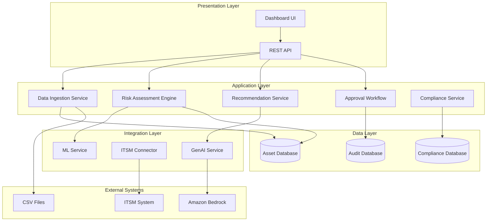
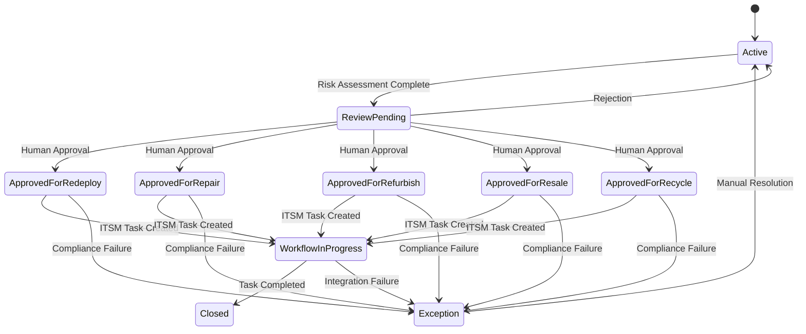

# Design Document: Intelligent E-Waste & Asset Lifecycle Optimizer

## Overview

The Intelligent E-Waste & Asset Lifecycle Optimizer is a Python-based decision engine that combines policy-driven rules with machine learning to optimize IT asset lifecycles. The system ingests asset metadata and telemetry data, applies risk assessment algorithms, and generates actionable recommendations for asset disposition (redeploy, repair, refurbish, resale, recycle).

The architecture follows a modular design with clear separation between data ingestion, risk assessment, recommendation generation, and external integrations. The system leverages Amazon Bedrock for GenAI capabilities and implements robust error handling with graceful degradation patterns.

Key design principles:
- **Deterministic and Auditable**: All decisions are traceable with immutable audit trails
- **Graceful Degradation**: System continues operating when external services fail
- **Human-in-the-Loop**: Critical decisions require human approval before execution
- **Compliance-First**: Region-specific compliance requirements are enforced before irreversible actions

## Architecture

The system follows a layered architecture with the following components:



### State Machine Design

Assets progress through a well-defined state machine that ensures proper workflow control:



## Components and Interfaces

### Data Ingestion Service

**Purpose**: Handles CSV file parsing and API data ingestion with validation and data quality assessment.

**Key Responsibilities**:
- Parse and validate CSV asset data
- Calculate data completeness scores
- Handle missing or malformed data gracefully
- Trigger risk assessment for newly ingested assets

**Interface**:
```python
class DataIngestionService:
    def ingest_csv(self, file_path: str) -> IngestionResult
    def validate_asset_data(self, asset_data: Dict) -> ValidationResult
    def calculate_data_completeness(self, asset_data: Dict) -> float
```

### Risk Assessment Engine

**Purpose**: Combines policy-based rules with ML models to generate risk scores and confidence levels.

**Key Responsibilities**:
- Apply policy thresholds for risk classification
- Invoke ML models when sufficient telemetry is available
- Handle graceful degradation to policy-only mode
- Generate confidence bands (Low/Medium/High)

**Policy Rules**:
- High risk if: `age >= 42 months AND tickets >= 5`
- High risk if: `thermal_events >= 10 OR smart_sectors >= 50`
- Medium risk if: partial criteria met
- Low risk if: criteria not met

**ML Model Integration**:
- Target AUC-ROC ≥ 0.70 based on research showing gradient boosting models achieving 0.914 AUC in similar risk scoring applications
- Logistic regression baseline with gradient boosting for enhanced performance
- Feature engineering from telemetry data, ticket aggregates, and asset metadata
- Model validation using cross-validation and holdout test sets

**Interface**:
```python
class RiskAssessmentEngine:
    def assess_risk(self, asset: Asset) -> RiskAssessment
    def apply_policy_rules(self, asset: Asset) -> PolicyResult
    def invoke_ml_model(self, asset: Asset) -> MLResult
    def determine_confidence_band(self, assessment: RiskAssessment) -> ConfidenceBand
```

### Recommendation Service

**Purpose**: Generates lifecycle recommendations based on risk assessments and business rules.

**Key Responsibilities**:
- Map risk scores to lifecycle actions
- Generate recommendation rationale
- Integrate with GenAI for explanations
- Handle fallback to template-based explanations

**Recommendation Logic**:
- High risk + old age → Recycle
- High risk + repairable issues → Repair
- Medium risk + good condition → Refurbish
- Low risk + department change → Redeploy
- Low risk + excess inventory → Resale

**Interface**:
```python
class RecommendationService:
    def generate_recommendation(self, risk_assessment: RiskAssessment) -> Recommendation
    def create_explanation(self, recommendation: Recommendation) -> str
    def validate_recommendation(self, recommendation: Recommendation) -> bool
```

### GenAI Service

**Purpose**: Provides AI-powered explanations, task scaffolding, and conversational insights using Amazon Bedrock.

**Key Responsibilities**:
- Generate recommendation explanations (≤120 words, factual, hedged language)
- Create ITSM task titles, descriptions, and checklists
- Summarize compliance documents
- Handle conversational queries over structured data

**Implementation Details**:
- Amazon Bedrock integration with JSON schema validation
- 10-second timeout with graceful fallback
- Structured prompts for consistent output format
- Error handling for service unavailability

**Interface**:
```python
class GenAIService:
    def generate_explanation(self, recommendation: Recommendation) -> str
    def scaffold_itsm_task(self, recommendation: Recommendation) -> ITSMTaskContent
    def summarize_compliance_doc(self, document: ComplianceDocument) -> str
    def process_conversational_query(self, query: str) -> str
```

### ITSM Connector

**Purpose**: Integrates with external ITSM systems for task creation and workflow management.

**Key Responsibilities**:
- Create tasks via REST API with idempotent external_ref
- Implement retry logic with exponential backoff
- Handle API failures and timeout scenarios
- Maintain task status synchronization

**Retry Strategy**:
- Exponential backoff: 1s, 2s, 4s, 8s, 16s
- Maximum 5 retry attempts
- Jitter to prevent thundering herd
- Circuit breaker for persistent failures

**Interface**:
```python
class ITSMConnector:
    def create_task(self, task_content: ITSMTaskContent) -> TaskResult
    def update_task_status(self, external_ref: str, status: str) -> bool
    def retry_with_backoff(self, operation: Callable) -> Result
```

### Compliance Service

**Purpose**: Manages region-specific compliance requirements and document validation.

**Key Responsibilities**:
- Enforce region-specific compliance rules
- Validate compliance documents
- Block irreversible actions until compliance verified
- Generate compliance reports and certificates

**Region Configuration**:
- India: Requires e-waste certificate, chain of custody, disposal invoice
- EU: WEEE directive compliance, data destruction certificate
- US: EPA guidelines, state-specific requirements

**Interface**:
```python
class ComplianceService:
    def validate_compliance(self, asset: Asset, action: str) -> ComplianceResult
    def upload_compliance_document(self, document: ComplianceDocument) -> ValidationResult
    def generate_compliance_report(self, assets: List[Asset]) -> ComplianceReport
```

### Approval Workflow

**Purpose**: Manages human approval processes with immutable audit trails.

**Key Responsibilities**:
- Present recommendations for human review
- Capture approval decisions with rationale
- Create immutable snapshots of asset state
- Maintain complete audit trail

**Interface**:
```python
class ApprovalWorkflow:
    def submit_for_approval(self, recommendation: Recommendation) -> ApprovalRequest
    def process_approval_decision(self, decision: ApprovalDecision) -> ApprovalResult
    def create_audit_snapshot(self, asset: Asset, recommendation: Recommendation) -> AuditSnapshot
```

## Data Models

### Core Entities

```python
@dataclass
class Asset:
    asset_id: str
    device_type: str  # laptop, server
    purchase_date: datetime
    department: str
    region: str
    current_state: AssetState
    data_completeness: float
    created_at: datetime
    updated_at: datetime

@dataclass
class Telemetry:
    asset_id: str
    battery_cycles: Optional[int]
    smart_sectors_reallocated: Optional[int]
    thermal_events_count: Optional[int]
    last_updated: datetime
    data_source: str  # csv, api, manual

@dataclass
class TicketsAggregate:
    asset_id: str
    window_start: datetime
    window_end: datetime
    total_incidents: int
    critical_incidents: int
    high_incidents: int
    medium_incidents: int
    low_incidents: int
    avg_resolution_time_hours: float

@dataclass
class RiskAssessment:
    asset_id: str
    risk_score: float  # 0.0 to 1.0
    confidence_band: ConfidenceBand  # Low, Medium, High
    policy_result: PolicyResult
    ml_result: Optional[MLResult]
    assessment_timestamp: datetime
    model_version: str
    policy_version: str

@dataclass
class Recommendation:
    recommendation_id: str
    asset_id: str
    action: LifecycleAction  # redeploy, repair, refurbish, resale, recycle
    confidence_score: float
    rationale: str
    explanation: str
    supporting_signals: List[str]
    created_at: datetime
    expires_at: datetime

@dataclass
class ApprovalAudit:
    audit_id: str
    recommendation_id: str
    actor: str
    decision: ApprovalDecision  # approved, rejected
    rationale: str
    asset_snapshot: Dict  # Immutable asset state
    recommendation_snapshot: Dict  # Immutable recommendation state
    timestamp: datetime

@dataclass
class ComplianceDocument:
    document_id: str
    asset_id: str
    document_type: str  # certificate, invoice, chain_of_custody
    region: str
    file_path: str
    verification_status: VerificationStatus
    uploaded_at: datetime
    verified_at: Optional[datetime]
    summary: Optional[str]  # GenAI generated

@dataclass
class RegionConfig:
    region: str
    compliance_requirements: List[str]
    required_documents: List[str]
    blocking_actions: List[LifecycleAction]
    config_version: str
    effective_date: datetime
```

### Enumerations

```python
class AssetState(Enum):
    ACTIVE = "active"
    REVIEW_PENDING = "review_pending"
    APPROVED_FOR_REDEPLOY = "approved_for_redeploy"
    APPROVED_FOR_REPAIR = "approved_for_repair"
    APPROVED_FOR_REFURBISH = "approved_for_refurbish"
    APPROVED_FOR_RESALE = "approved_for_resale"
    APPROVED_FOR_RECYCLE = "approved_for_recycle"
    WORKFLOW_IN_PROGRESS = "workflow_in_progress"
    CLOSED = "closed"
    EXCEPTION = "exception"

class LifecycleAction(Enum):
    REDEPLOY = "redeploy"
    REPAIR = "repair"
    REFURBISH = "refurbish"
    RESALE = "resale"
    RECYCLE = "recycle"

class ConfidenceBand(Enum):
    LOW = "low"
    MEDIUM = "medium"
    HIGH = "high"
```

### KPI Data Models

```python
@dataclass
class KPIMetric:
    metric_name: str
    value: float
    unit: str
    provenance: ProvenanceTag  # observed_outcome, policy_default, model_estimate
    calculation_method: str
    data_sources: List[str]
    timestamp: datetime
    confidence_interval: Optional[Tuple[float, float]]

class ProvenanceTag(Enum):
    OBSERVED_OUTCOME = "observed_outcome"
    POLICY_DEFAULT = "policy_default"
    MODEL_ESTIMATE = "model_estimate"
```

## Correctness Properties

*A property is a characteristic or behavior that should hold true across all valid executions of a system—essentially, a formal statement about what the system should do. Properties serve as the bridge between human-readable specifications and machine-verifiable correctness guarantees.*

Based on the prework analysis and property reflection, the following properties capture the essential correctness requirements while avoiding redundancy:

### Property 1: CSV Data Ingestion Validation
*For any* CSV file with valid asset data format, the ingestion process should successfully parse the data and achieve data completeness of at least 0.6 for a minimum of 70% of the assets in the file.
**Validates: Requirements 1.1, 1.2**

### Property 2: Required Asset Data Preservation
*For any* valid asset data ingested into the system, the stored asset record should contain all required fields (purchase date, department, region, device type) with values matching the input data.
**Validates: Requirements 1.3, 1.4**

### Property 3: Telemetry-Based Evaluation Mode Selection
*For any* asset with telemetry data completeness below the threshold, the system should mark the asset for policy-only evaluation and exclude it from ML model scoring.
**Validates: Requirements 1.5, 3.4**

### Property 4: Ticket Aggregation Window Correctness
*For any* set of ticket data spanning multiple time periods, the 90-day window aggregation should include only tickets within the specified window and correctly calculate total incidents, severity distribution, and resolution times.
**Validates: Requirements 2.1, 2.2, 2.3**

### Property 5: Policy-Based Risk Classification
*For any* asset meeting the policy criteria (age ≥ 42 months AND tickets ≥ 5) OR (thermal events ≥ 10 OR SMART sectors ≥ 50), the Policy Engine should classify the asset as High risk.
**Validates: Requirements 3.1, 3.2**

### Property 6: Risk Assessment Completeness
*For any* completed risk assessment, the result should include a valid confidence band (Low, Medium, High), risk score between 0.0 and 1.0, and appropriate model/policy version tags.
**Validates: Requirements 3.5, 4.3**

### Property 7: Recommendation Generation Completeness
*For any* risk assessment, the system should generate a recommendation with a valid lifecycle action, confidence score, rationale, and supporting signals, and transition the asset to ReviewPending state.
**Validates: Requirements 4.1, 4.2, 4.4**

### Property 8: State Machine Transition Correctness
*For any* asset state transition (approval, rejection, ITSM success, ITSM failure), the system should move to the correct target state according to the state machine definition and log the transition with actor, timestamp, and rationale.
**Validates: Requirements 5.2, 6.4, 6.5, 14.1**

### Property 9: Immutable Audit Trail Creation
*For any* approval decision (approve or reject), the system should create an immutable audit record containing the decision, rationale, and complete snapshots of both asset state and recommendation data at the time of decision.
**Validates: Requirements 5.3, 5.4, 14.2**

### Property 10: ITSM Integration Idempotency
*For any* approved recommendation, creating ITSM tasks multiple times with the same recommendation data should use the same external_ref value to prevent duplicate task creation.
**Validates: Requirements 6.1, 6.2**

### Property 11: ITSM Retry Logic
*For any* ITSM API call that returns a 5xx error, the system should implement exponential backoff retry logic with increasing delays (1s, 2s, 4s, 8s, 16s) for up to 5 attempts before transitioning to Exception state.
**Validates: Requirements 6.3**

### Property 12: Region-Specific Compliance Enforcement
*For any* asset in a region with compliance requirements (e.g., India), the system should block irreversible disposal actions until all required compliance documents are uploaded and verified.
**Validates: Requirements 7.1, 7.2, 7.5**

### Property 13: Compliance Document Validation
*For any* uploaded compliance document, the system should validate the format and completeness against region-specific requirements and update the ComplianceDocument record with appropriate verification status.
**Validates: Requirements 7.3, 7.4, 10.2, 10.3**

### Property 14: GenAI Output Validation and Fallback
*For any* GenAI service request (explanation, task scaffolding, document processing), if the service is unavailable or times out after 10 seconds, the system should fall back to template-based or policy-only alternatives and validate all outputs against JSON schema requirements.
**Validates: Requirements 8.1, 8.3, 8.4, 8.5, 9.3, 9.4, 10.4**

### Property 15: At-Least-Once ITSM Event Delivery
*For any* ITSM event that needs to be delivered, the system should ensure the event is delivered at least once, even in the presence of network failures or service interruptions, through retry mechanisms and persistent queuing.
**Validates: Requirements 12.3**

### Property 16: KPI Calculation and Provenance Completeness
*For any* KPI calculation request, the system should compute all required metrics (Deferred Spend, Life Extension, Compliance Completion Rate, Prediction Coverage, Human Override Rate, GenAI Health), tag each with appropriate provenance indicators (observed_outcome, policy_default, model_estimate), and maintain an audit trail of computation methods and input data.
**Validates: Requirements 13.1, 13.2, 13.5**

### Property 17: KPI Export and Metadata Transparency
*For any* KPI data display or export request, the system should provide CSV export functionality and include calculation methodology and data source information for transparency.
**Validates: Requirements 13.3, 13.4**

### Property 18: Audit Data Retrieval Completeness
*For any* audit data request for an asset, the system should return complete decision history with supporting evidence, including all state transitions, approval decisions, and contextual snapshots.
**Validates: Requirements 14.3, 14.5**

### Property 19: Conversational Query Data Access
*For any* natural language query processed by the conversational service, the system should access the structured semantic layer for data retrieval and provide responses with data provenance information.
**Validates: Requirements 11.2, 11.3**

### Property 20: Graceful Error Handling and Recovery
*For any* system error (missing telemetry, vendor API delays, external service unavailability), the system should continue processing with available data, log detailed error information, mark confidence appropriately, and automatically resume processing when services recover.
**Validates: Requirements 15.1, 15.2, 15.3, 15.4, 15.5**

## Error Handling

The system implements comprehensive error handling strategies to ensure resilience and data integrity:

### Graceful Degradation Patterns

1. **Telemetry Unavailability**: When telemetry data is missing or incomplete, the system falls back to policy-only risk assessment while maintaining audit trails of the degradation decision.

2. **GenAI Service Failures**: When Amazon Bedrock is unavailable or times out, the system uses template-based explanations and task scaffolding to maintain functionality.

3. **ITSM Integration Failures**: When ITSM APIs are unavailable, assets transition to Exception state with detailed error context, allowing for manual intervention and later retry.

4. **ML Model Failures**: When ML models fail to load or execute, the system gracefully degrades to policy-only evaluation with appropriate confidence marking.

### Retry and Circuit Breaker Patterns

```python
class RetryConfig:
    max_attempts: int = 5
    base_delay: float = 1.0
    max_delay: float = 60.0
    exponential_base: float = 2.0
    jitter: bool = True

class CircuitBreakerConfig:
    failure_threshold: int = 5
    recovery_timeout: int = 60
    half_open_max_calls: int = 3
```

### Error Classification and Handling

- **Transient Errors**: Network timeouts, temporary service unavailability → Retry with exponential backoff
- **Permanent Errors**: Invalid data format, authentication failures → Immediate failure with detailed logging
- **Degraded Service**: Partial data availability, reduced functionality → Continue with reduced capabilities
- **Critical Errors**: Data corruption, security violations → Immediate halt with alerting

## Testing Strategy

The system employs a dual testing approach combining unit tests for specific scenarios with property-based tests for comprehensive coverage:

### Unit Testing Focus Areas

- **Integration Points**: ITSM API integration, Amazon Bedrock integration, database operations
- **Edge Cases**: Boundary conditions for risk thresholds, empty data sets, malformed inputs
- **Error Conditions**: Specific failure scenarios, timeout handling, authentication failures
- **State Machine Transitions**: Specific state change scenarios and validation

### Property-Based Testing Configuration

The system uses **Hypothesis** for Python property-based testing with the following configuration:

- **Minimum 100 iterations** per property test to ensure statistical confidence
- **Custom generators** for domain-specific data (assets, telemetry, recommendations)
- **Shrinking strategies** to find minimal failing examples
- **Deterministic seeding** for reproducible test runs

Each property test is tagged with a comment referencing its design document property:
```python
@given(asset_data=asset_generator())
def test_csv_ingestion_validation(asset_data):
    """Feature: e-waste-asset-optimizer, Property 1: CSV Data Ingestion Validation"""
    # Test implementation
```

### Test Data Generation Strategies

- **Asset Generator**: Creates realistic asset data with configurable completeness ratios
- **Telemetry Generator**: Generates sparse and complete telemetry data patterns
- **Ticket Generator**: Creates ticket aggregates with various severity distributions
- **Time-based Generators**: Handle date ranges, windows, and temporal relationships

### Performance Testing

- **Batch Processing**: Validate 1,000+ asset processing within 5-minute target
- **Dashboard Response**: Measure p95 latency under various load conditions
- **Memory Usage**: Monitor memory consumption during large batch operations
- **Concurrent User Load**: Test dashboard performance with multiple simultaneous users

### Integration Testing

- **End-to-End Workflows**: Complete asset lifecycle from ingestion to ITSM task creation
- **External Service Mocking**: Simulate Amazon Bedrock and ITSM API responses
- **Compliance Scenarios**: Test region-specific compliance enforcement
- **Error Recovery**: Validate system behavior during and after service failures

The testing strategy ensures that both individual components and the complete system behavior are validated against the requirements, with property-based tests providing comprehensive input coverage and unit tests focusing on specific critical scenarios.